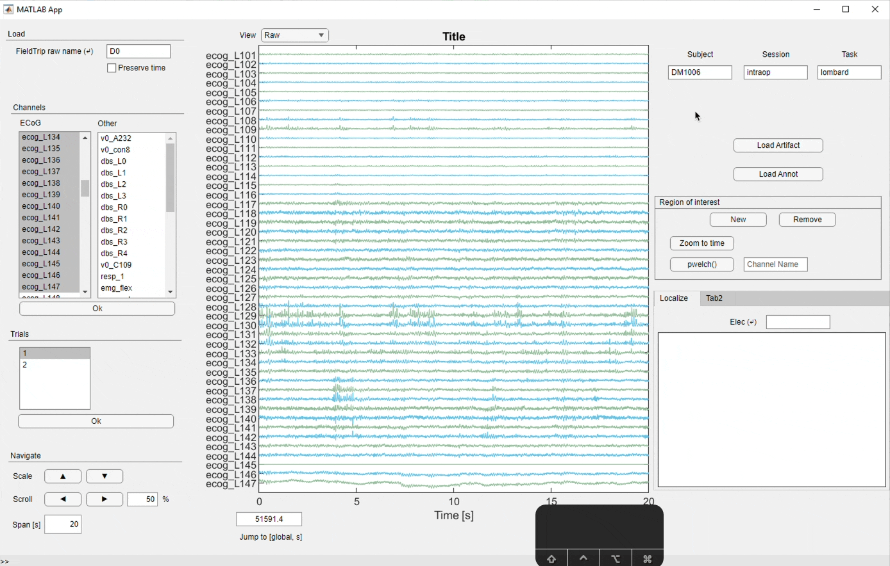

GUI for Viewing High-Channel Count Data with MATLAB FieldTrip Objects
=====================================================================

This graphical user interface (GUI) provides an intuitive way to visualize MATLAB FieldTrip objects with high-channel-count data. It is designed for neuroscience students and researchers who want to explore and analyze data from neurophysiological experiments.

Why not FieldTrip's native `ft_databrowser()`? 
--------
If you've ever used it, you know why not. For large raw FieldTrip objects, it's slow and clunky and... kinda ugly.  I started exploring alternatives because it painfully slow in visualizing an object with ~50 channels and ~15 mins of 1kHz data. It would take ~5 seconds to jump from one segment of data to another, making it unuseable. For high-channel count data, it's useful to be able to quickly sift through data, flag potential artifacts, and annotate regions of interest. 

Features
--------

The GUI includes the following features:

-   Easy data loading: The GUI allows users to load FieldTrip objects in your workspace just by typing them into the box. 
-   Data visualization: 50-channel simulataneous visualization with <1s update times. 
-   Channel selection: The GUI allows users to select which channels to visualize and, in the case of trialed data, visualize many trials from one channel.

Feature requests: 

- y-axis scale bars for each individual channel, useful for comparing scales across channels

System requirements
-------------------

The GUI is built in MATLAB 2021a. I have not tested in other versions of MATLAB. I have been using it on the Brain Modulation Lab server exclusively. 

Installation
------------

The only required dependencies are: [FieldTrip](https://www.fieldtriptoolbox.org/) and [PlotBig](https://www.mathworks.com/matlabcentral/fileexchange/40790-plot-big). 

To ensure that these are installed, try `which ft_selectdata` (a FieldTrip function) and `which LinePlotReducer` (a Plot Big function) in the MATLAB command line. These should return paths to the files. If they are not found, download these packages and add them to your path

How to use
----------

To run the GUI, simply type `bml_databrowser` into your command line. 

Please see the video below for basic functionality. Keep an eye on the keystrokes (in the bottom right of the GUI window), which make navigation much faster. 

- For BML, you can load annotation files to see when behavioral events occurred during the recording.

- For BML, you can also load artifact files to visualize your artifact rejections in the raw recording. 

Support
-------

If you encounter any issues or have suggestions for improvement, please create an issue in the repository or contact Latane Bullock.

Acknowledgements
----------------

The GUI was designed and implemented by Latane Bullock in MATLAB App Designer as part of his work for the the Brain Modulation Lab at Mass General Hospital. 

The package would also not be any more useful than the native `ft_databrowser` if it weren't for the upgrade in visualization speed powered by [PlotBig](https://www.mathworks.com/matlabcentral/fileexchange/40790-plot-big). 

License
-------

This software is licensed under the [insert license type] license. See the LICENSE file for details.
